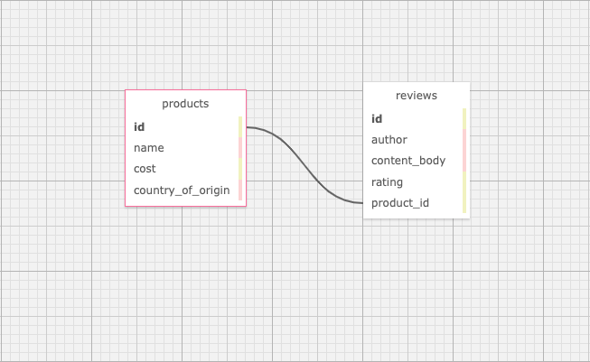

# Mario's Speciality Food Products

#### A website that uses authentication, and allows the user to add products and also add reviews for each product. 

#### Created By: **Frank Proulx**

## Technologies Used

* _HTML_
* _CSS_
* _Bootstrap_ 
* _Ruby_
* _Gems_
* _Bundler_
* _RSpec_
* _shoulda matchers_
* _IRB_
* _Pry_
* _Capybara_
* _SimpleCov_
* _Devise_
* _Postgres_
* _SQL_
* _SQL Designer_
* _Rails_
* _ActiveRecord_
* _Bootstrap scss_
* _Faker_

## Description

_This project was created to show proficiency in Rails with Active Record for both relational databases with nested routing, as well as authentication and authorization using Devise. The application is for a website that lists products and adds reviews for individual products. The user can add/remove/edit products and reviews._

## Database Schema

## System Requirements

* Ruby v2.6.5 recommended
* Postgres 12.9  
_(Note: Ruby gem dependencies will be installed automatically by Bundler.)_

## Setup/Installation Requirements

* Clone the GitHub repository: [https://github.com/Frank-Proulx/w11_speciality_food_products](https://github.com/Frank-Proulx/w11_speciality_food_products)
* From the main project directory, enter `bundle install` in the terminal to populate gems.
* To create a database, type in your terminal: 
      `rake db:setup`
* Enter `rspec` into the terminal to confirm passing of all tests (see notes in known bugs if this is causing an error).
* Run `rails s` to start the Rails server.
* Open browswer and enter the url http://localhost:3000/ unless otherwise prompted in the terminal.
* Running `rake db:setup` will seed the database with two users, one admin and one not. The login for the admin is `admin@email.com` and the login for the non-admin user is `user@email.com`, password for both is `testing`. 

## Known Bugs

* The rspec command was causing an error saying the versions were off. Typing `bundle exec rspec` instead solves this issue. I was also able to solve this permanantly by changing the version of rspec-expectations in `Gemfile.lock` from (3.10.1) to (3.10.2).  

## License

_[MIT](https://opensource.org/licenses/MIT)_

If you have any issues, questions, ideas or concerns, please reach out to me at my email and/or make a contribution to the code via GitHub.

Copyright (c) _2022_ _Frank Proulx_

